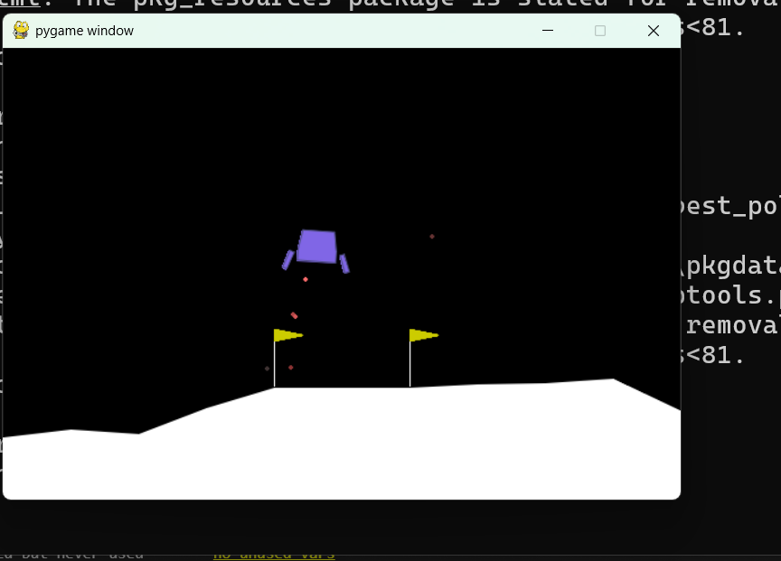
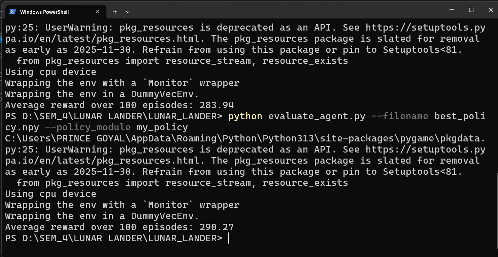

# Lunar Lander AI Agent

This project implements an AI agent that plays the LunarLander-v3 environment from OpenAI Gymnasium using Proximal Policy Optimization (PPO). The agent achieves a high score of **292**. The project includes scripts for training, evaluating, and playing the agent, as well as human play support.

## Project Structure

- `train_agent.py`: Train or play the PPO agent. Saves the best policy as a NumPy file.
- `train_agent_2205.py`: Train or play an agent using Particle Swarm Optimization (PSO) to optimize the policy parameters for LunarLander-v3. This approach can further improve the agent's score beyond standard PPO training. The best policy is saved as `best_policy_2205_2.npy`.
- `evaluate_agent.py`: Evaluate a saved policy using a custom policy action function.
- `my_policy.py`: (You should implement your policy_action function here for evaluation.)
- `play_lunar_lander.py`: Play the game using keyboard controls (human play).
- `best_policy.npy`: Saved best policy parameters.
- `best_policy_2205_2.npy`: Saved best PSO-optimized policy parameters.
- `1.png`: Screenshot of Lunar Lander home/play screen.
- `2.png`: Screenshot showing the achieved score.

## Screenshots

### Lunar Lander Home/Play


### Achieved Score


## How to Run

### 1. Install Requirements

Install the required Python packages:

```bash
pip install gymnasium[box2d] stable-baselines3 torch numpy pygame 
```

- `gymnasium[box2d]`: For the LunarLander-v3 environment
- `stable-baselines3`: For PPO implementation
- `torch`: For neural network operations
- `numpy`: For numerical operations
- `pygame`: For human play interface

**Note:**
- The `box2d` dependency for Gymnasium requires [SWIG](http://www.swig.org/) to be installed on your system. On Windows, you can download the SWIG executable and add it to your system PATH. On Linux/macOS, you can typically install it via your package manager (e.g., `sudo apt-get install swig` or `brew install swig`).

### 2. Train the Agent (Optional)

You can train the agent using either PPO or PSO:

#### PPO Training (Standard)
```bash
python train_agent.py --train --timesteps 100000
```
This will save the best policy to `best_policy.npy`.

#### PSO Training (Advanced)
```bash
python train_agent_2205.py --train
```
This will save the best PSO-optimized policy to `best_policy_2205_2.npy`.

### 3. Evaluate the Agent

To evaluate the trained agent and see the average reward:

#### For PPO Policy
```bash
python evaluate_agent.py --filename best_policy.npy --policy_module my_policy
```
#### For PSO Policy
```bash
python evaluate_agent.py --filename best_policy_2205_2.npy --policy_module my_policy
```

- `--filename best_policy.npy`: Path to the saved policy parameters
- `--policy_module my_policy`: Python module containing your `policy_action` function

### 4. Play as a Human

To play the game yourself using keyboard controls:

```bash
python play_lunar_lander.py
```

#### Controls
- `W`: Fire main engine
- `A`: Fire left engine
- `D`: Fire right engine
- `S`: Do nothing
- `Q`: Quit after an episode

## Notes
- Make sure to implement the `policy_action(policy, observation)` function in `my_policy.py` for evaluation.
- The agent achieves an average score of **292** over 100 episodes (with PPO). Using PSO (`train_agent_2205.py`), you may achieve even higher scores depending on optimization.

---

Enjoy experimenting with the Lunar Lander AI agent!
